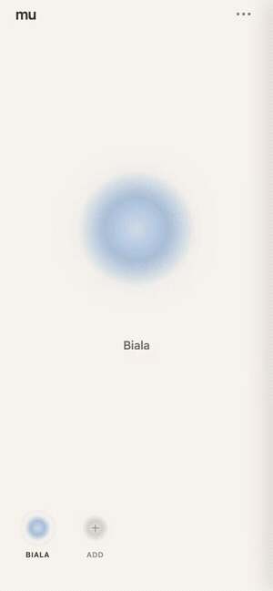

# mu

mu is a small app for staying in touch without really talking. Each person you connect with gets one orb. Press and hold it when you are thinking of them, and they see a soft glow the next time they open the app. If you are both pressing at once, the orb shifts into a shared state with a light haptic pulse. No feed, no chat, no notifications pulling you back in.

The idea is simple: a quiet way to let someone know you are thinking of them, without writing a message.

Built with React Native and Expo, using Firebase Realtime Database for live presence and pairing. There is no formal account system. Each install gets a random local identity, and two people connect through a short invite code or link.

Status: working prototype, deployed as a web app, being tried out by a small group of real people. Native builds are not published to the App Store or Play Store yet.
